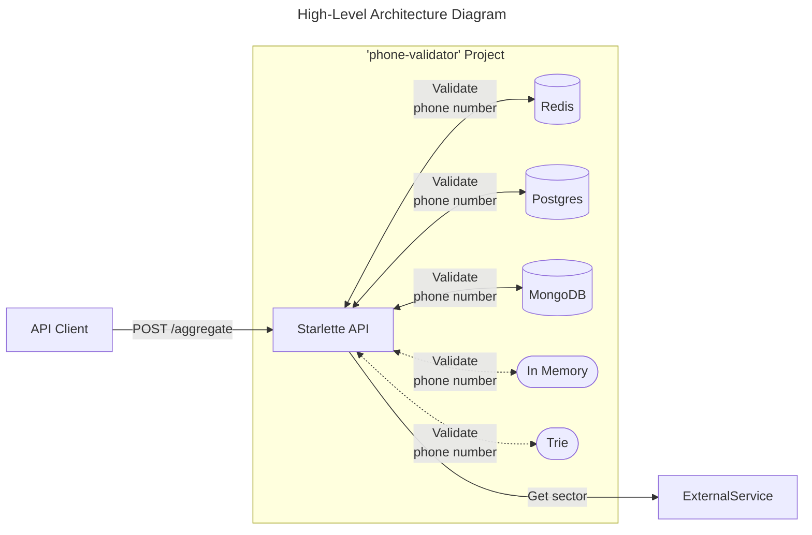

# Phone Validator Challenge

This exercise is part of my blog post ["Tools vs Data-Structures"](https://www.andreffs.com/blog/tools-vs-data-structures/). You can read all about the rational for this there.

## Install

To run this locally you just need docker.

You should be able to just run ```make``` to build the project and run it.

## Usage

List of available commands:

* `make`: builds project and starts it with default environments
* `make clean`: stops docker compose and removes all containers and volumes
* `make lint`: runs linting on project
* `make test`: runs pytest
* `make load`: runs loadtest

There are 2 main modes of running this project:
* In memory
  * Simple for loop
  * Trie data structure
* Database
  * Postgres
  * Mongo
  * Redis



To choose which backend to use, you need to define the .env "BACKEND" to one of the following options:

```bash
# ~/project/.env
BACKEND=backend.in_memory
BACKEND=backend.trie
BACKEND=backend.mongo
BACKEND=backend.postgres
BACKEND=backend.redis
```

> If no .env is given, the default `backend.trie` is used.

Then to make a request to the service, just do

```bash
$ curl -X POST http://localhost:8080/aggregate \
   -H 'Content-Type: application/json' \
   -d '["+1983248", "00351917355", "+147 8192", "+351917312", "+ 918851"]'
````
